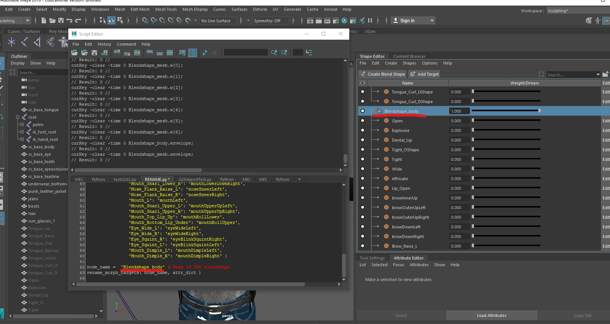

# Software that should be downloaded already by this page
* Maya 2018 or 2019
* Maya student version download here: https://www.autodesk.com/education/free-software/maya
* Fuse downloaded from here: https://www.adobe.com/products/fuse.html

# Running the script in Maya
This step is after you completed designing your 3D character in your specific software of your choosing. 

# Using Python in Maya
There are no plugins required for this step. To use this script you want to open Maya and open the script editor at the bottom right. 


Once you have the window open, select the python tab. If you do not see one, hit the "+" and choose python and the tab will have the label Python. 

Now once you name your blendshape group is changed to "Blendshape_mesh" and all the necessary targets are merged you can run our script!


# Using Python

Once you open the script editor there should be a MEL tab and a Python tab. Open the MEL and just copy and paste the code below into the maya script editor


Then scroll all the down the code until you see a some yellow and red words, please refer to the screenshot below.


Next, you want insert the "Blendshape_whatever" name in between the '' after you type in the name, you can hit the execute all button at the top.


Once the code executes, the specific target blendshapes should have changed to camel case naming convention.

Like so in this screenshot. 



**Now scroll all the way down this page to see the next steps!**
------------------------------------------------------------------------------------------------------------------------------------------------------------------------

```Python
import maya.cmds

def rename_morph_targets( node_name, attr_dict, quiet = False ):
	# list to catch our failures	
	fail_list = [ ]

	# How many targets there are in the alias list
	number_of_targets = maya.cmds.getAttr( '{0}.weight'.format( node_name ), size = True )

	# Iterate through the weight list
	for index in range( 0, number_of_targets ):
		# Query the name of the current blendshape weight
		old_name = maya.cmds.aliasAttr( '{0}.weight[{1}]'.format( node_name, index ), query = True )

		# If the old name isn't in the attr_dict, we're going to pass on it.
		if old_name in attr_dict.keys( ):
			# We're going to rename
			new_name = attr_dict[ old_name ]
			print 'Found old name: ', index, new_name, old_name
			
			absolute_name = '{0}.weight[{1}]'.format( node_name, index )

			maya.cmds.aliasAttr( new_name, absolute_name ) # Re-aliasing / Renaming occurs here.
			if not quiet:
				print 'Changed {0} -> {1}'.format( old_name, new_name )
				
		# Add the failure to the fail list		
		else:
			fail_list.append( old_name )

	if fail_list:
		maya.cmds.warning( '{0} names were not changed. Check console for details'.format( len( fail_list ) ) )
		for name in fail_list:
			print name

attr_dict = { 'Blink_Left': 'eyeBlinkLeft',
                'Blink_Right': 'eyeBlinkRight',
                'BrowsDown_Left': 'browDownLeft',
                'BrowsDown_Right': 'browDownRight',
                'BrowsUp_Left': 'browOuterUpLeft',
                'BrowsUp_Right': 'browOuterUpRight',
                'Frown_Left': 'mouthFrownLeft',
                'Frown_Right': 'mouthFrownRight',
                'Jaw_Down': 'jawOpen',
                'Jaw_Left': 'jawLeft',
                'Jaw_Right': 'jawRight',
		'Jaw_Up': 'mouthClose',
                'LowerLipDown_Left': 'mouthLowerDownLeft',
                'LowerLipDown_Right': 'mouthLowerDownRight', 
		'NoseScrunch_Left': 'noseSneerLeft',
		'NoseScrunch_Right': 'noseSneerRight',
                'SmileLeft': 'mouthLeft',
                'SmileRight': 'mouthRight',
                'UpperLipUp_Left': 'mouthUpperUpLeft',
                'UpperLipUp_Right': 'mouthUpperUpRight',
		'UpperLipIn': 'mouthUpperUpRight',
		'LowerLipIn': 'mouthRollUpper',
		'MidMouth_Right': 'mouthRight',
		'MidMouth_Left': 'mouthLeft',
		'EyesWide_Left': 'eyeWideLeft',
		'EyesWide_Right': 'eyeWideRight',
		'Squint_Leftt': 'eyeBlinkSquintRight',
		'Smile_Left': 'mouthDimpleLeft',
		'Smile_Right': 'mouthDimpleRight',
                'Squint_Right': 'eyeBlinkSquintLeft'  }

node_name = '' # Insert Blendshape_whatever name of the blendshape between the quotes!!
rename_morph_targets( node_name, attr_dict )
```

------------------------------------------------------------------------------------------------------------------------------------------------------------------------

### After blendshape targets are renamed you can export this model as a FBX and import into Unreal! 

**You can go to file > Export all > make sure the file type is FBX and then save it to a location on your computer.**

# The next steps are [here](https://github.com/RLabNYC/Rlab_FaceTracking_fuse/blob/master/IMPORTING.md)

## If you need to go back to the table of [contents](https://github.com/RLabNYC/RLab_Facetracking). For the Fuse modeling steps go [here](https://github.com/RLabNYC/RLab_Facetracking)


